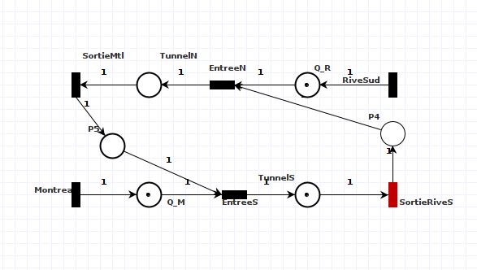
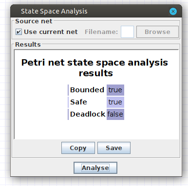
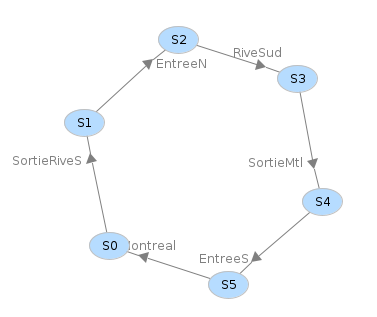
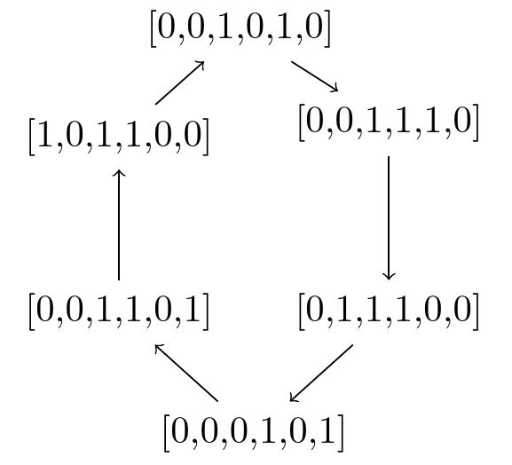

<h1 class="center">🚧👷 Analyse du réseau pétri (Tunnel) 🚧👷 </h1>

### 🚓 Loi de conservation:

Notre réseau de pétri respecte la loi de conservation,  les jetons restent constants pour les états atteignables, les jetons ne disparaissent pas du système, ils ne s'engrendrent pas de manière arbitaire. *Le nombre de jetons est limité au une certaine constante K*. **(Système borné)**.

#### 🔒  Dans notre cas particulier *K = 1* :

**Par exemple:** si on commence à Montréal, on sort du tunnel, et on reviens à la situation initiale, on réalise qu'il y au plus un jeton par place dans le diagramme.
 
 - Si on regarde l'animation le nombre de jetons par place reste ≤  1.

- PIPE confirme que notre **réseau est sécuritaire** dans *State Space Analysis*.

 

### 🚦 Zones d'exclusion mutuelle

- Les états P₅ et P₄ agissent comme des semaphores **(Aucune voiture ne peut traverser lorsqu'une autre voiture emprunte la voie contraire)**.

 - Lorsqu'une voiture rentre dans le tunnel, elle consomme un jeton et elle le libère dès qu'elle sort du tunnel.

 
- **Cela est fait en accord à l'énoncé du devoir:**
 

> ***« On introduit une lumière de chaque côté qui permet de faire passer une voiture à la fois de chaque côté de manière équitable.»***
>
> –<cite>DM2</cite>

###  Analyse selon le graphe de couverture:

### 🌵  Nos transitions sont **vivaces**:
- Il n'existe pas de transition morte (L0) dans notre réseau.

- Toutes les transitions peuvent être franchies au moins k.
  -  *k = {k | k >1 ∈ N}*  fois de type ***(L-2 vivante).***

### ❌  Aucun interblockage

- Le graphe de couverture n'amènent pas à un cul-de-sac.
- PIPE le confirme dans *State Space Analysis*.

### 🍲 Pas de famine:

- Il n'existe pas une séquence qui part vers un sous-arbre du graphe et ne revienne jamais. **(notre graphe et cyclique)**

### 🤝🏼  Traitement équitable

- Sur l'animation gif en haut de ce rapport,  on remarque que, lorsqu'une voiture sort du tunnel, on donne inmédiatement la place à celle de la voie contraire. 
  - Une voiture viens après l'autre du sens contraire.

- Il n'existe pas une situation qui donne une priorité à une voie sur une autre.
